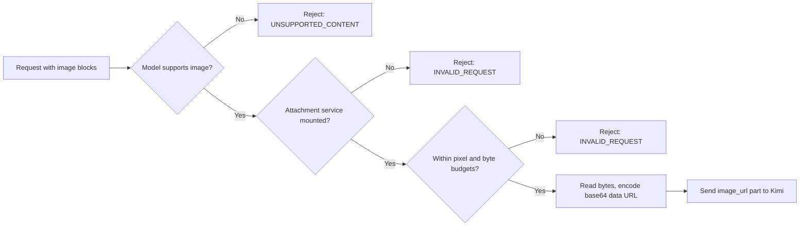

# Image input

All four Kimi Code models accept images. When a request carries image content, the adapter resolves each image through the harness attachment service (`ctx.attachments`) and inlines it as a base64 `image_url` data URL in the OpenAI-compatible chat-completions body.

## Flow



- Text-only requests never touch the attachment service.
- Image references are collected from every message, including nested tool results.
- Each image is budgeted from its durable reference metadata before any bytes are read.

## Budgeting is internal

The plugin enforces its own budget from the durable attachment metadata (`width`, `height`, `bytes`) rather than depending on a request-scoped projection from the attachment service. An image is rejected when:

- its pixel count (`width * height`) exceeds `imagePixelBudget` (default `8294400`, Kimi's 4K ceiling), or
- its encoded byte length exceeds `imageMaxBytes` (default `1048576`, 1 MiB).

The byte budget keeps the base64-expanded payload within Kimi's per-message size limit. Both budgets are configurable in `cordis.yml`. See [Configuration](configuration.md).

## Rejection cases

| Condition | Error code |
| --- | --- |
| Image sent to a model without image support | `UNSUPPORTED_CONTENT` |
| Image present but attachment service not mounted | `INVALID_REQUEST` |
| Image over `imagePixelBudget` or `imageMaxBytes` | `INVALID_REQUEST` |

## Wire format

Each image becomes an ordered content part beside any text:

```json
{
  "role": "user",
  "content": [
    { "type": "text", "text": "What single color fills this image?" },
    { "type": "image_url", "image_url": { "url": "data:image/png;base64,..." } }
  ]
}
```

Text-only messages keep the compact string form. Supported media types are PNG, JPEG, WebP, and GIF.
